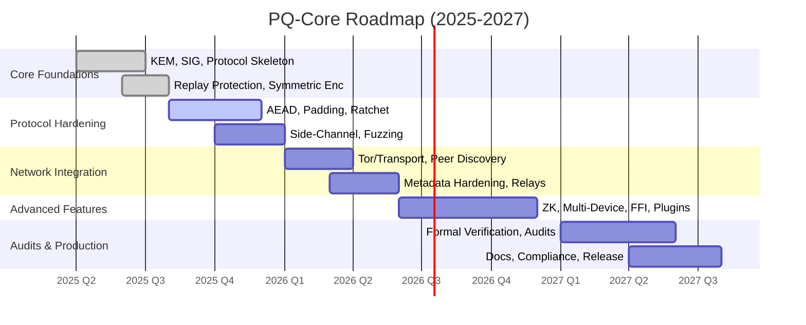

# 🛣️ PQ-Core Technical Roadmap (2025-2027)

## Vision

Build a modular, auditable, and production-grade post-quantum cryptography core for secure, decentralized, and anonymous communication. PQ-Core aims to be the backbone for next-generation privacy apps, mesh networks, and quantum-resilient protocols.

---

## Phase 1: Core Foundations (2025 Q2–Q3)

- [x] Modular KEM (Kyber-like) implementation
- [x] Modular PQ signature (Dilithium-style)
- [x] Protocol skeleton: handshake, session, replay protection
- [x] Basic symmetric encryption (AES-256-GCM/ChaCha20-Poly1305)
- [x] Zeroization and constant-time ops
- [x] Initial test suite & CI
- [ ] **Milestone:** End-to-end encrypted message exchange with replay protection

---

## Phase 2: Protocol Hardening & Security (2025 Q3–Q4)

- [ ] Full authenticated encryption with associated data (AEAD)
- [ ] Message padding, traffic normalization, and onion-wrapping
- [ ] Forward secrecy & post-compromise security (PQ ratchet)
- [ ] Key rotation & session expiration
- [ ] Side-channel resistance audit
- [ ] Fuzzing, property-based, and adversarial testing
- [ ] **Milestone:** Survives simulated quantum and classical attacks

---

## Phase 3: Network Integration (2026 Q1–Q2)

- [ ] Tor/I2P/mesh network transport adapters
- [ ] Decentralized peer discovery (DHT, QR, invite codes)
- [ ] Metadata-hardened communication (timing, size, cover traffic)
- [ ] Pluggable transport and relay modules
- [ ] **Milestone:** Anonymous, metadata-resistant P2P chat demo

---

## Phase 4: Advanced Features & Ecosystem (2026 Q2–Q4)

- [ ] ZK-proof integration for identity and selective disclosure
- [ ] Multi-device and multi-session support
- [ ] Mobile/FFI bindings (Rust → Swift/Kotlin/C++)
- [ ] WASM/Node.js bindings for web integration
- [ ] Plugin system for custom crypto modules
- [ ] **Milestone:** PQ-Core powering real-world apps (messaging, dating, whistleblowing)

---

## Phase 5: Audits, Compliance, and Productionization (2027)

- [ ] Formal verification of core primitives
- [ ] Third-party cryptographic audits
- [ ] Documentation, threat models, and whitepapers
- [ ] AGPL/dual-licensing review
- [ ] **Milestone:** PQ-Core 1.0 stable release

---

## Graph: PQ-Core Roadmap Overview

---

## Dependencies & Research

- NIST PQC standards (Kyber, Dilithium, etc.)
- Tor/I2P/mesh protocols
- ZK-proof systems (zk-SNARKs, Bulletproofs)
- FFI and WASM best practices
- Formal verification tools (KLEE, Coq, etc.)

---

## Risks & Mitigations

- **Quantum algorithm breakthroughs:** Track NIST, academia, and update primitives as needed.
- **Side-channel attacks:** Prioritize constant-time, audit, and fuzzing.
- **Usability vs. paranoia:** Provide sane defaults, but allow deep customization.
- **Legal/compliance:** AGPL and dual-licensing, export controls.

---

## Contribution Guidelines

- All cryptographic changes require tests and documentation.
- No new dependencies without review.
- All protocol changes must be threat-modeled.
- Encourage external audits and responsible disclosure.

---

## Long-Term Vision

PQ-Core is not just a library—it's a foundation for a new era of secure, decentralized, and quantum-resilient communication. Join us in building the future.
