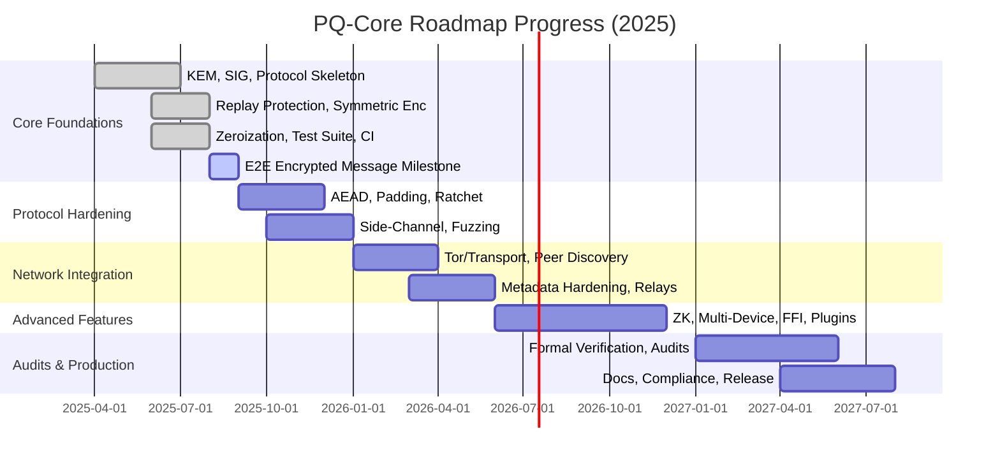

# 🛣️ PQ-Core Technical Roadmap Progress (as of June 2025)

## Progress Overview

---

## Completion Estimate

- **Phase 1 (Core Foundations): ~85%**
- **Overall Roadmap: ~15%**

- Core structure, stubs, and basic tests are present.
- Not yet production-ready; advanced protocol features and real cryptography are next.

---

## Next Steps
- Complete end-to-end encrypted message exchange with real cryptography.
- Begin protocol hardening and advanced features.

---

*Progress auto-updated as of June 2025.*
